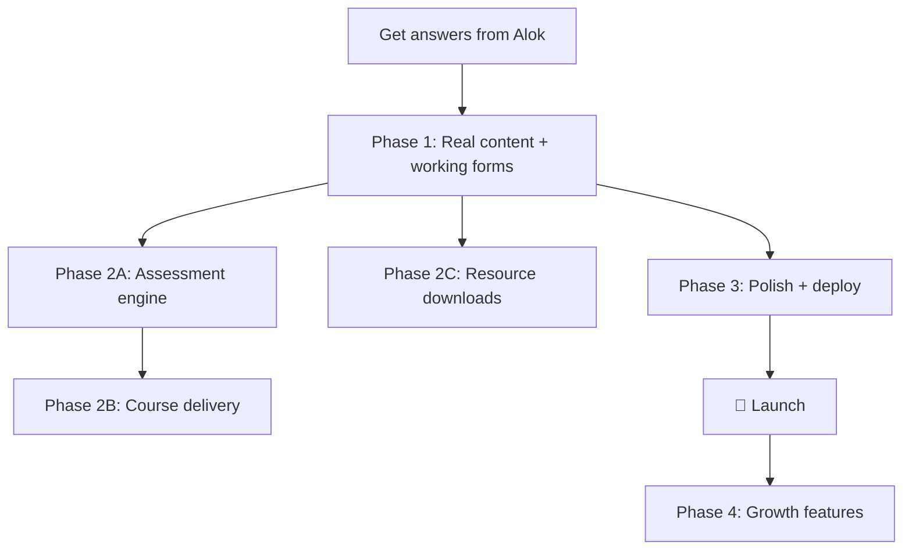

# CalmTree Discover — Production Readiness Roadmap

> **Current state:** Lovable-generated scaffold. Clean architecture, good component structure, zero real functionality behind the UI.

---

## The Honest Assessment

What **works** today:

- ✅ Routing, layout, navigation (TanStack Router, file-based)
- ✅ Responsive design (mobile nav, grid breakpoints)
- ✅ Design tokens (oklch palette, Fraunces + Inter typography)
- ✅ SEO meta tags on every page
- ✅ Legal pages (Privacy Policy + Terms — well-written, India-compliant)
- ✅ Sitemap generation (server-side XML)
- ✅ Zod validation on forms
- ✅ Dark mode CSS tokens defined

What's **fake**:

- ❌ Contact form — `setTimeout` mock, goes nowhere
- ❌ Newsletter — same fake submit
- ❌ All video thumbnails — gradient placeholders with Play icons
- ❌ Instagram grid — 8 empty gradient boxes
- ❌ Course enrollment — buttons exist, no logic
- ❌ Assessments — "Start assessment" buttons, no quiz engine
- ❌ Resource downloads — "Download PDF" buttons, no files
- ❌ Social links — all point to `#`
- ❌ Founder photo — gradient placeholder with User icon
- ❌ Sitemap `BASE_URL` — empty string
- ❌ No analytics, no error tracking
- ❌ No favicon/OG images
- ❌ Dark mode toggle — tokens exist, no UI switch
- ❌ No backend / database / auth

---

## Phase 1 — Make It Real (Critical Path to Launch)

These are **blockers**. Without these, the site is a clickable mockup.

### 1.1 Real Content & Media

| Item                 | What to Do                                                                                | Effort             |
| -------------------- | ----------------------------------------------------------------------------------------- | ------------------ |
| Founder photo        | Get Alok's headshot, replace `<User>` icon placeholder                                    | Quick              |
| YouTube video embeds | Replace Play-icon gradient cards with actual `<iframe>` embeds or YouTube API             | Medium             |
| Instagram feed       | Either embed real IG posts (IG oEmbed API) or remove the section                          | Medium             |
| Social links         | Fill in actual YouTube channel URL, Instagram handle                                      | Quick              |
| Course descriptions  | Verify all course titles/descriptions with Alok — are these real courses or aspirational? | Quick (needs Alok) |
| OG image             | Design a proper `og:image` for social sharing                                             | Quick              |
| Favicon              | CalmTree leaf icon as `.ico` + apple-touch-icon                                           | Quick              |

### 1.2 Working Contact Form

The form has good Zod validation already. Just needs a real backend.

**Options (pick one):**

- **Resend** — send form data as an email to `hello@calmtree.in` via TanStack Start server function. Cleanest.
- **Formspree / Web3Forms** — zero-backend, form submits to a third-party endpoint. Fastest.
- **Supabase** — store submissions in a table + trigger email. Most flexible if you're already using Supabase elsewhere.

> [!TIP]
> Given this runs on TanStack Start with Nitro (SSR), a server function calling Resend is probably the tightest approach — 15 lines of server code, no third-party form service.

### 1.3 Working Newsletter Signup

Same pattern as contact form. Needs a real email service.

**Options:**

- **ConvertKit / Beehiiv** — best for solo creator newsletters. Has audience management, sequences, analytics built-in.
- **Resend + Supabase** — store subscribers in a table, use Resend for sends. Full control but you're building the newsletter system.

> [!IMPORTANT]
> ConvertKit is probably the right call here. Alok is a solo psychology educator — he needs audience management, not a custom newsletter platform. Just POST to their API from the form.

### 1.4 Sitemap & Robots.txt

- Set `BASE_URL` to `https://calmtree.in` (or whatever the domain is)
- Add a `robots.txt` route (allow all, point to sitemap)

### 1.5 Analytics

- **Plausible** or **Umami** (privacy-friendly, no cookie banner needed) — or Google Analytics if Alok prefers
- Add to `__root.tsx` shell

### 1.6 Error Tracking

- The codebase already has `reportLovableError` wired up. Either keep the Lovable integration or replace with **Sentry** for production.

---

## Phase 2 — Functional Features (What Makes It a Platform)

These turn the site from a brochure into an actual product.

### 2.1 Assessment Engine

This is CalmTree's **engagement hook** — the thing that makes people stay and share.

**Architecture decision:** Client-side or server-side scoring?

For educational self-checks (not clinical), **client-side is fine:**

- Define questions + scoring rubrics as JSON data
- Build one reusable `<Assessment>` component that consumes the data
- Score locally, show results immediately — no account needed
- Optionally gate the detailed report behind email capture (lead gen)

> [!NOTE]
> **FireRed approach:** One assessment engine, data-driven. Five different JSON configs produce five different assessments. Don't build five separate quiz pages.

**Structure:**

```
src/
  data/
    assessments/
      burnout.json        # questions, options, scoring weights
      stress.json
      emotional-intel.json
      personality.json
      self-esteem.json
  components/
    AssessmentRunner.tsx   # one engine — takes config, renders quiz, scores, shows result
  routes/
    assessments/
      $slug.tsx            # dynamic route: /assessments/burnout, /assessments/stress, etc.
```

**Effort:** Medium-High (2-3 days for engine + 5 assessment configs)

### 2.2 Course Delivery (Academy)

This is where **monetization** lives. Critical question for Alok:

**Are courses free or paid?**

#### If Free (or "free with email gate"):

- Host video content on YouTube (unlisted or public)
- Build a lesson viewer: sidebar with lesson list + main area with embedded video + text content
- Gate access behind email capture
- Track progress in `localStorage` (no auth needed)

#### If Paid:

- Need **authentication** (Supabase Auth or Clerk)
- Need **payments** (Razorpay — India-standard)
- Need a **database** to track enrollment + progress
- This is a significant architecture change

> [!WARNING]
> If courses are paid, this becomes a full-stack app with auth, payments, and a database. That's a different scope than a content site. Clarify with Alok before building.

### 2.3 Resource Downloads (PDFs)

Simple — but needs real files.

- Alok creates the actual workbooks/journals as PDFs
- Host on Cloudinary, S3, or even `/public/resources/`
- Wire up download buttons with real `href`s
- Optional: gate behind email capture for lead gen

### 2.4 Structured Data (JSON-LD)

For SEO — add schema.org markup:

- `Organization` schema on homepage
- `Person` schema on about page
- `Course` schema on academy pages (Google rich results)
- `FAQPage` if you add an FAQ section

This directly impacts search appearance. Google shows rich cards for courses.

---

## Phase 3 — Polish & Hardening (Pre-Launch)

### 3.1 Performance

- [ ] Lazy-load YouTube iframes (use `loading="lazy"` or Intersection Observer)
- [ ] Optimize images (WebP, proper sizing, `srcset`)
- [ ] Check bundle size — the shadcn/ui imports pull in a lot of Radix. Tree-shake unused components
- [ ] Add `rel="preload"` for critical fonts

### 3.2 Accessibility

- [ ] Keyboard navigation for all interactive elements
- [ ] ARIA labels on icon-only buttons (some already exist, verify all)
- [ ] Focus visible styles
- [ ] Skip-to-content link
- [ ] Color contrast check on sage green palette (oklch values need verification)

### 3.3 Dark Mode

- CSS tokens already defined but the dark mode uses a completely different palette (blue-purple instead of sage green) — this looks like Lovable's default dark theme, not a CalmTree dark theme
- Either redesign dark mode to match CalmTree's brand or remove the `.dark` tokens
- If keeping: add a toggle in the header

### 3.4 Security Headers

Add via Nitro/Cloudflare config:

- `Content-Security-Policy`
- `X-Content-Type-Options: nosniff`
- `X-Frame-Options: DENY`
- `Referrer-Policy: strict-origin-when-cross-origin`
- `Permissions-Policy`

### 3.5 Deployment

The Vite config uses `@lovable.dev/vite-tanstack-config` which bundles Nitro with **Cloudflare** as default target.

**Options:**

- **Cloudflare Pages** — the path of least resistance given the config. Free tier is generous.
- **Vercel** — change Nitro preset. Works well with TanStack Start.
- **VPS** — if Alok wants full control. Need to change Nitro target to `node-server`.

> [!IMPORTANT]
> Decide deployment target before building server functions (contact form, newsletter API). The Nitro preset affects how server code runs.

---

## Phase 4 — Growth (Post-Launch)

These are not launch blockers but make the platform grow.

| Feature             | Why                                                                    | Effort                    |
| ------------------- | ---------------------------------------------------------------------- | ------------------------- |
| Blog / Articles     | SEO-driven content marketing. Alok writes, site ranks.                 | Medium                    |
| Email sequences     | Welcome series after newsletter signup. ConvertKit handles this.       | Low (if using ConvertKit) |
| Course certificates | Generate PDF certificates on completion. Social proof + sharing.       | Medium                    |
| Testimonials        | Social proof section on homepage + course pages.                       | Low                       |
| Community           | Discord/WhatsApp group link for engaged learners.                      | Quick                     |
| Multi-language      | Hindi content for wider India reach. i18n setup.                       | High                      |
| PWA                 | Installable on mobile. Service worker for offline access to resources. | Medium                    |

---

## Decisions Needed from Alok

Before we write a single line of code, these questions need answers:

1. **Are courses free or paid?** (This determines the entire backend architecture)
2. **What's the domain?** (Is `calmtree.in` live? DNS configured?)
3. **Where to host?** (Cloudflare Pages is the default — is that acceptable?)
4. **YouTube channel URL + Instagram handle?** (Fill in social links)
5. **Does the founder photo exist?** (Or do we need to handle that?)
6. **Are the 5 assessment topics confirmed?** (Or are some aspirational?)
7. **Are the PDF resources ready?** (Or do those need to be created?)
8. **Newsletter provider preference?** (ConvertKit? Beehiiv? Something else?)
9. **Budget for services?** (Resend, analytics, etc. — most have free tiers that work)

---

## Suggested Execution Order



**Estimated timeline:**

- Phase 1: **2-3 days** (mostly integration + content swap)
- Phase 2A (Assessments): **2-3 days**
- Phase 2C (Resources): **Half day** (assuming PDFs exist)
- Phase 2B (Courses): **3-5 days** (if paid, add 3-4 more for auth + payments)
- Phase 3: **1-2 days**
- **Total to launch-ready: ~8-12 days** (depending on paid vs free courses)

---

> The scaffold is clean. The architecture is sound. What it needs is **substance** — real content, real integrations, and one well-built engine for assessments that can power everything. Classic FireRed territory: one engine, many uses.
